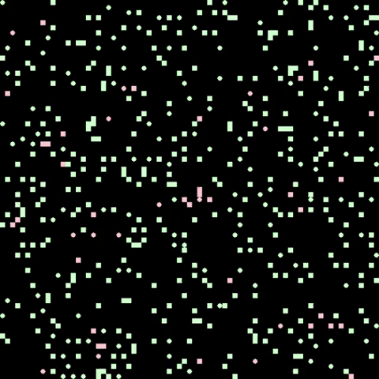

# Epidemic Simulation with Cellular Automation
The purpose of this repo is to simulate an epidemic with simple rules, specifically, COVID-19.
In addition, there are two main policies in-effect or that have been in-effect in certain states across the U.S and other countries. These two policies are social distancing and wearing a mask. This simulation explores just how important these policies can be to decreasing the spread of a virus and specifically COVID-19. 

Please read my [medium article](https://towardsdatascience.com/simulating-covid-19-with-cellular-automata-aeb820910a9) on this simulation and its results to get a better view of the simulation details as well as how effective different safety polcies are. 

# The Simulation
It consists of a grid which represents the world. People populate the world which can have varying attributes such as whether they social distance, wear a mask, move a lot or are altruistic.
People who wear a mask have a lower probability of infecting another (like in reality). People who socially distance try to stay at least one cell away from all other people.
All people can move around (random walk) and move multiple steps at once to keep people from staying in there initial neighborhoods. If someone gets infected they will
progress through the infection either being asymptomatic, having mild symptoms, severe symptoms or even dying. Another important aspect is altriusm (which can be adjusted) 
which means that a person who is altruistic will begin to practice social distancing and wearing a mask if they get infected (if they were not already). Through these
simple rules, an accurate yet simplistic view of safety is potrayed.

## Statistics and Probabilities
Almost all stats and probs used in the constants were researched to be close to realistic COVID-19 data (references in `constants_reference.py` and `stats.txt`). 
Of course there is a lot of disagreeance over many of these stats and they have changed overtime, so I tried to stick to trustworthy sources such as the CDC and to more
recent sources. However, some values I could not find and had to estimate for what made sense. I note these in each constants' reference.

## Dependencies
* numpy
* pandas (for saving data to CSV)
* pygame (for rendering)

## Running it
Run `main.py` to run the simulation. It uses the constants defined in `constants.py` (whose references can be found in `constants_reference.py`). You can also choose to
render it or not with the render argument (`CA.run(render=True)`). In addition, data can print out such as number of infected or dead as the simulation runs (`DataCollector.set_print_options()`).
Lastly, you can save experiments and show visualizations after the simulation finishes (`DataCollector(constants, save_experiment=True, print_visualizations=True)`).
Experiments are saved in `experiments/`, which saves data, plots and constants used.
